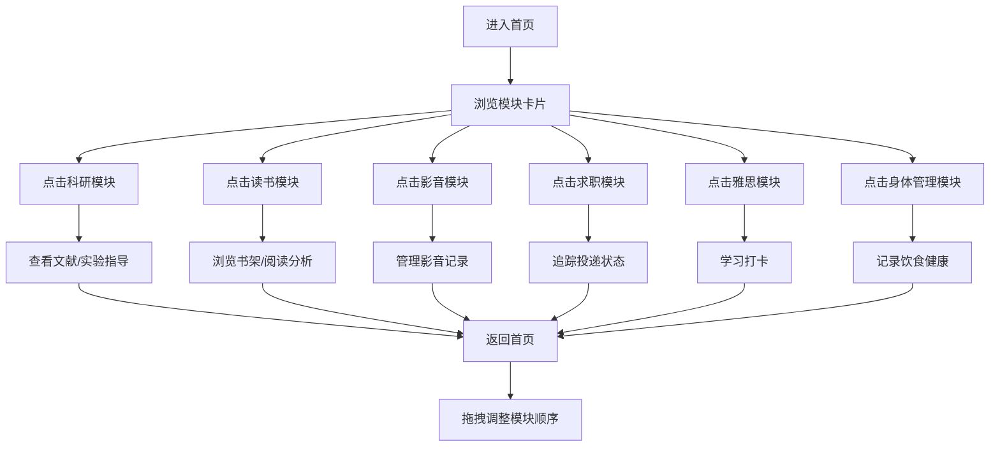

## 1. 产品概述
个人模块化网页工作台，为生物正交研究方向的在校研究生提供一站式科研、学习、生活管理平台。通过可拖拽的模块化布局，整合科研文献管理、阅读记录、影音收藏、求职追踪、雅思学习和健康管理六大核心模块，实现日常流程自动化与高效管理。

- 目标用户：生物正交研究方向的在校研究生
- 核心价值：模块化、个性化、自动化的个人工作台

## 2. 核心功能

### 2.1 用户角色
| 角色 | 注册方式 | 核心权限 |
|------|----------|----------|
| 个人用户 | 本地使用 | 使用所有模块功能，自定义模块布局 |

### 2.2 功能模块
1. **首页**：可拖拽排序的模块卡片网格，展示各模块概览
2. **科研模块**：文献推送、PPT生成、AI实验指导、实验周报
3. **读书模块**：微信读书同步、阅读记录、阅读分析、书单推荐
4. **影音记录模块**：电视剧/电影分类、评分影评、多刷记录、标签管理
5. **求职追踪模块**：岗位推荐、投递状态跟踪、面试提醒、经验整理
6. **雅思学习模块**：听说读写单词子模块、打卡、进度追踪
7. **身体管理模块**：健康数据、饮食记录、补剂记录、AI营养师建议

### 2.3 页面详情
| 页面名称 | 模块名称 | 功能描述 |
|----------|----------|----------|
| 首页 | 模块卡片网格 | 可拖拽排序的模块卡片，展示各模块今日概览数据 |
| 首页 | 顶部导航栏 | 应用标题、设置入口、当前日期 |
| 科研页 | 文献推送 | 每日生物正交前沿文献，摘要+思维导图，按周归档，手动添加 |
| 科研页 | PPT生成 | 每两月生成3-4篇文献汇报PPT，含思维导图和演讲稿 |
| 科研页 | AI实验指导 | 输入实验进展/问题获取建议，智能实验助手 |
| 科研页 | 实验周报 | 自动整理带标签的每周实验周报，支持回溯查询 |
| 读书页 | 书架展示 | 已读书目列表，支持微信读书同步和手动添加纸质书 |
| 读书页 | 阅读分析 | 每周阅读分析报告，阅读时长/数量统计 |
| 读书页 | 书单推荐 | 每月1-2本定制书单，书籍打分，重读标记 |
| 影音页 | 分类导航 | 电视剧/电影分类切换，标签筛选 |
| 影音页 | 作品卡片 | 海报、评分、影评、多刷次数、标签管理 |
| 求职页 | 岗位列表 | 2027秋招对口岗位每日更新，招聘链接 |
| 求职页 | 投递追踪 | 投递状态管理，面试提醒，经验分类整理 |
| 雅思页 | 学习子模块 | 听、说、读、写、单词五大子模块 |
| 雅思页 | 打卡系统 | 每日打卡，学习进度追踪可视化 |
| 身体管理页 | 健康概览 | 健身/健康数据同步展示，身体指标卡片 |
| 身体管理页 | 饮食记录 | 拍照识别餐食，计算热量和三大营养素 |
| 身体管理页 | 补剂/周期 | 补剂记录、生理周期记录，AI营养师建议 |
| 身体管理页 | 目标追踪 | 身材管理目标设定，进度追踪 |

## 3. 核心流程

用户进入首页 → 浏览各模块概览 → 点击模块进入详情页 → 使用对应功能 → 返回首页可拖拽调整模块顺序

## 4. 用户界面设计

### 4.1 设计风格
- **主色调**：浅紫色系（#A78BFA 为主，渐变至 #C4B5FD）
- **辅助色**：淡粉色、薰衣草紫、薄荷绿点缀
- **背景色**：极浅的紫白色（#FAF5FF），带有微妙的渐变和玻璃拟态效果
- **按钮风格**：圆润胶囊形，浅紫渐变填充，hover 时有柔和的阴影和缩放效果
- **字体**：标题使用优雅的衬线字体，正文使用简洁的无衬线字体
- **布局风格**：卡片式布局，圆角柔和（16-20px），玻璃拟态质感，阴影轻盈
- **图标风格**：线性+填充混合风格，紫色调渐变图标，配合柔和的光晕效果
- **动效风格**：轻盈流畅的过渡动画，200-300ms 缓动，入场时的渐显和轻微上浮

### 4.2 页面设计概览
| 页面名称 | 模块名称 | UI 元素 |
|----------|----------|---------|
| 首页 | 模块卡片网格 | 玻璃拟态卡片、渐变图标、可拖拽手柄、悬停上浮效果、渐入动画 |
| 首页 | 顶部导航 | 渐变标题文字、磨砂玻璃效果、设置图标按钮 |
| 科研页 | 文献列表 | 文献卡片、摘要展开、思维导图预览、标签筛选、按周归档时间轴 |
| 科研页 | AI对话 | 聊天气泡、输入框、发送按钮、思考动画 |
| 读书页 | 书架 | 书籍封面卡片、评分星星、阅读进度条、分类标签 |
| 读书页 | 分析图表 | 柱状图、折线图、环形进度、数据卡片 |
| 影音页 | 作品墙 | 海报网格、评分徽章、标签云、筛选器 |
| 求职页 | 岗位追踪 | 时间线进度、状态标签、公司logo、面试倒计时 |
| 雅思页 | 学习面板 | 五模块卡片、打卡日历、进度圆环、学习时长统计 |
| 身体管理页 | 健康仪表盘 | 数据卡片、环形图表、饮食记录时间线、目标进度条 |

### 4.3 响应式设计
- **桌面端优先**：1440px 基准设计，多列网格布局
- **平板适配**：768px-1024px，两列布局，侧边导航收起为图标
- **手机适配**：375px-768px，单列布局，底部导航栏，卡片全屏宽度
- **触控优化**：移动端按钮最小 44px，增大点击区域，支持滑动操作

### 4.4 视觉细节
- 背景使用柔和的紫色渐变叠加噪点纹理
- 卡片采用玻璃拟态效果（backdrop-filter: blur）
- 模块图标带有微妙的发光效果
- 页面切换时有顺滑的淡入淡出和滑动过渡
- 数据加载时使用骨架屏和脉冲动画
