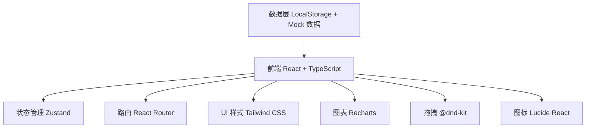

## 1. 架构设计



## 2. 技术描述

- **前端框架**：React@18 + TypeScript + Vite
- **初始化工具**：vite-init（react-ts 模板）
- **后端**：无后端，纯前端应用，数据存储于 LocalStorage
- **状态管理**：Zustand
- **路由**：react-router-dom
- **样式**：Tailwind CSS 3.x
- **图表库**：Recharts
- **拖拽排序**：@dnd-kit/core + @dnd-kit/sortable
- **图标库**：lucide-react
- **数据存储**：LocalStorage（持久化）+ Mock 数据（初始演示数据）

## 3. 路由定义

| 路由 | 页面 | 用途 |
|------|------|------|
| / | 首页 | 模块卡片网格，可拖拽排序 |
| /research | 科研模块 | 文献推送、PPT生成、AI实验指导、实验周报 |
| /reading | 读书模块 | 书架、阅读分析、书单推荐 |
| /media | 影音记录 | 电视剧/电影记录、评分、标签 |
| /career | 求职追踪 | 岗位列表、投递状态、面试提醒 |
| /ielts | 雅思学习 | 听说读写单词、打卡、进度 |
| /health | 身体管理 | 健康数据、饮食记录、目标追踪 |

## 4. 数据模型

### 4.1 模块配置
```typescript
interface ModuleConfig {
  id: string;
  name: string;
  icon: string;
  route: string;
  order: number;
  visible: boolean;
}
```

### 4.2 科研模块
```typescript
interface Paper {
  id: string;
  title: string;
  authors: string;
  journal: string;
  date: string;
  abstract: string;
  mindMapUrl?: string;
  tags: string[];
  week: number;
  year: number;
}

interface ExperimentNote {
  id: string;
  date: string;
  title: string;
  content: string;
  tags: string[];
  week: number;
  year: number;
}

interface ChatMessage {
  id: string;
  role: 'user' | 'assistant';
  content: string;
  timestamp: string;
}
```

### 4.3 读书模块
```typescript
interface Book {
  id: string;
  title: string;
  author: string;
  cover: string;
  rating: number;
  status: 'reading' | 'finished' | 'want-to-read';
  isPhysical: boolean;
  needReread: boolean;
  tags: string[];
  startedDate?: string;
  finishedDate?: string;
  thoughts: string[];
}

interface ReadingStats {
  week: number;
  year: number;
  booksRead: number;
  totalMinutes: number;
  categories: Record<string, number>;
}
```

### 4.4 影音模块
```typescript
interface MediaItem {
  id: string;
  title: string;
  type: 'movie' | 'tv';
  poster: string;
  rating: number;
  review: string;
  watchCount: number;
  tags: string[];
  lastWatchedDate?: string;
}
```

### 4.5 求职模块
```typescript
interface JobPosition {
  id: string;
  company: string;
  position: string;
  link: string;
  status: 'interested' | 'applied' | 'interview' | 'offer' | 'rejected';
  postedDate: string;
  category: string;
  interviewDate?: string;
  notes: string;
}

interface InterviewExperience {
  id: string;
  company: string;
  date: string;
  round: string;
  questions: string;
  summary: string;
  tags: string[];
}
```

### 4.6 雅思模块
```typescript
interface IeltsModule {
  id: 'listening' | 'speaking' | 'reading' | 'writing' | 'vocabulary';
  name: string;
  totalHours: number;
  targetScore: number;
  currentScore: number;
}

interface StudyRecord {
  id: string;
  date: string;
  module: string;
  duration: number;
  content: string;
}

interface CheckInRecord {
  date: string;
  completed: boolean;
  modules: string[];
}
```

### 4.7 身体管理模块
```typescript
interface HealthData {
  date: string;
  weight?: number;
  steps?: number;
  exerciseMinutes?: number;
  sleepHours?: number;
}

interface MealRecord {
  id: string;
  date: string;
  mealType: 'breakfast' | 'lunch' | 'dinner' | 'snack';
  name: string;
  calories: number;
  protein: number;
  carbs: number;
  fat: number;
  photoUrl?: string;
}

interface Supplement {
  id: string;
  name: string;
  dosage: string;
  time: string;
  takenDates: string[];
}

interface PeriodRecord {
  id: string;
  startDate: string;
  endDate?: string;
  symptoms: string[];
  notes: string;
}

interface FitnessGoal {
  id: string;
  type: 'weight' | 'body-fat' | 'muscle';
  targetValue: number;
  currentValue: number;
  startDate: string;
  targetDate: string;
}
```

## 5. 项目结构

```
src/
├── components/          # 通用组件
│   ├── Layout/         # 布局组件
│   ├── ModuleCard/     # 模块卡片组件
│   └── ui/             # 基础UI组件
├── pages/              # 页面组件
│   ├── Home/
│   ├── Research/
│   ├── Reading/
│   ├── Media/
│   ├── Career/
│   ├── Ielts/
│   └── Health/
├── store/              # Zustand 状态管理
│   ├── useModuleStore.ts
│   ├── useResearchStore.ts
│   ├── useReadingStore.ts
│   ├── useMediaStore.ts
│   ├── useCareerStore.ts
│   ├── useIeltsStore.ts
│   └── useHealthStore.ts
├── data/               # Mock 数据
│   └── mockData.ts
├── utils/              # 工具函数
│   ├── storage.ts
│   └── date.ts
├── types/              # 类型定义
│   └── index.ts
├── App.tsx
├── main.tsx
└── index.css
```

## 6. 技术要点

1. **模块化设计**：每个功能模块独立管理状态和数据，降低耦合度
2. **拖拽排序**：使用 @dnd-kit 实现首页模块卡片的拖拽重排
3. **数据持久化**：使用 LocalStorage 保存用户数据，刷新不丢失
4. **响应式布局**：Tailwind CSS 响应式类，适配桌面/平板/手机
5. **动画效果**：CSS transitions + Tailwind 动画类，实现轻盈过渡
6. **玻璃拟态**：backdrop-filter + 半透明背景，实现现代玻璃效果
7. **图表可视化**：Recharts 实现阅读分析、健康数据等图表展示
